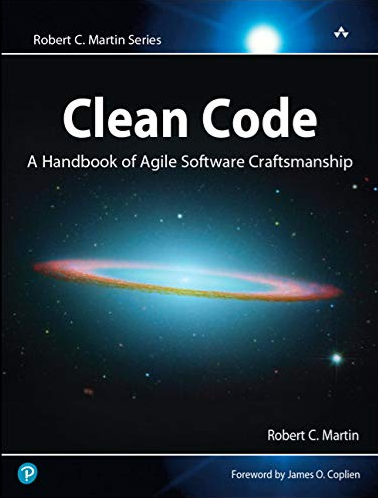

# کد تمیز

[فصل اول. کد تمیز](chapter01.md)

[فصل دوم. نام‌های بامعنی](chapter02.md)

[فصل سوم. توابع](chapter03.md)

[فصل چهارم. کامنت‌ها](chapter04.md)

[فصل پنجم. فرمت](chapter05.md)

[فصل ششم. اشیاء و ساختارهای داده‌ای](chapter06.md)

[فصل هفتم. مدیریت خطا](chapter07.md)

[فصل هشتم. مرزها](chapter08.md)

[فصل نهم. یونیت‌-تست‌ها](chapter09.md)

[فصل دهم. کلاس‌ها](chapter10.md)

[فصل یازدهم. سیستم‌ها](chapter11.md)

[فصل دوازدهم. اضطرار](chapter12.md)

[فصل سیزدهم. همروندی](chapter13.md)

[فصل چهاردهم. پالایش](chapter14.md)

